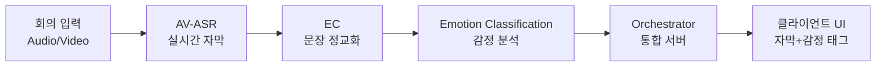
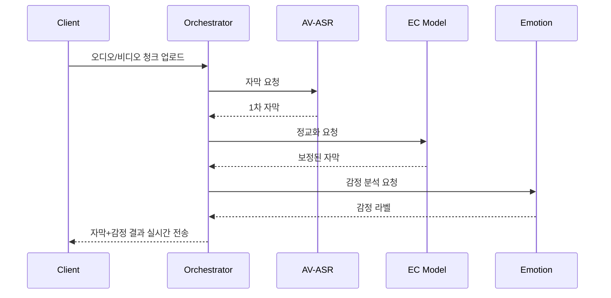
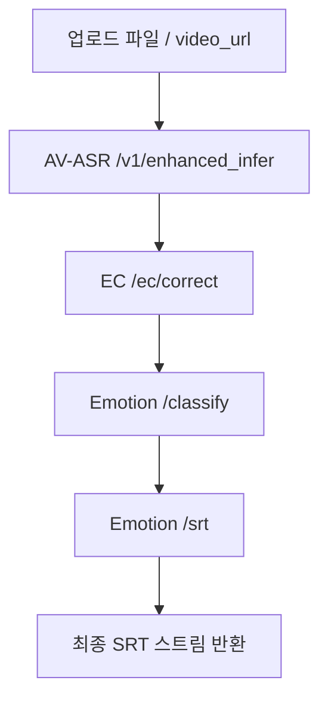

# LipSee : 청각장애인 대상 화상회의 실시간 통역 서비스

**👉 *모두가 동등하게 대화하는 회의 경험***

> LipSee는 화상회의 음성·영상에서 실시간 자막을 생성하고(AV-ASR) → 문장 품질을 정교화(EC) → 발화 감정까지 예측(Emotion Classification)하여, 청각장애인/농인 사용자도 대화 맥락을 놓치지 않도록 돕는 **실시간 접근성(Accessibility) 플랫폼**입니다.
> 

---

## 📌 핵심 가치 및 서비스 소개

- 실시간 정확한 자막 : 회의 음성과 영상 기반 실시간 전사
- 문장 정교화 : 비문/구어체 → 맞춤법 교정을 더한 자연스러운 문장 변환
- 감정 전달 : 발화의 뉘앙스를 감정 태그로 제공
- 소통 격차 해소 : 청각장애인과 비장애인 간의 원활한 커뮤니케이션 지원

---

## 👩‍💻 LipSee를 만든 사람들은 …

| 사진 |   |  |
|------|------------------------|------------------------|
| 이름 | 김예빈                 | 윤서영                 |
| 담당 | - AV-ASR: Video Encoder  
- Emotion Classification Model  
- 시연 영상 제작 | - AV-ASR: Audio Encoder  
- EC Model  
- 통합 Orchestrator 서버 구축  
- 서비스 소개 Web |


## 🎥 시연 스냅샷

📎 *향후 스크린샷 또는 데모 영상 링크 삽입 예정*

### [1차 : AV-ASR]

```json
...
"segments": [
    {
      "id": "seg_00000",
      "start": 0.0,
      "end": 66.837375,
      "text": "안녕하세요. 안녕하세요. 지금부터 회의를 시작하도록 하겠습니다. 오늘 저희가 다룰 회의 안건은 프로젝트 개발 진행사항 공유입니다. 서영님부터 진행사항 말씀해주세요. 네, 저는 1차 자막을 받아 발음 정교화 모델을 개발 중에 있습니다. 성능 평가는 해보셨나요? 네, 기존 오픈소스에 올라가 있는 한국어 특화 모델과 새롭게 개발한 모델의 성능을 비교해본 결과 대략 30% 정도 향상되었습니다. 네, 알겠습니다. 이번 주 대로 모델 개발 마무리해서 공유해주세요. 다음으로 저는 입모양 분석 모델을 개발 중에 있습니다. 네, 혹시 개발 중 이슈가 있으셨을까요? 있으시다면 공유 부탁드립니다. 네, 1차 테스트 결과가 많이 안 좋아서 현재 2차 시도 중에 있습니다. GPU 할당량 부족 문제가 있었는데 요금제 가입을 통해 이를 해결하고 있습니다. 네, 알겠습니다. 더 이상 공유 드릴 사항이 없으시다면마무리하겠습니다.수고 많으셨습니다. 수고하셨습니다.",
      "confidence": 0.925,
      "no_speech_prob": 0.02,
      "frame_entropy": 0.156,
      "tokens": [
        {
          "text": "안녕하세요.",
          "t0": 0.0,
          "t1": 0.6,
          "f0": 0,
          "f1": 15,
          "logprob": -0.15,
          "confidence": 0.85
        },
        {
          "text": "안녕하세요.",
          "t0": 0.6,
          "t1": 1.2,
          "f0": 15,
          "f1": 30,
          "logprob": -0.15,
          "confidence": 0.85
        },
        {
          "text": "지금부터",
          "t0": 1.2,
          "t1": 1.8,
          "f0": 30,
          "f1": 45,
          "logprob": -0.12,
          "confidence": 0.88
        }
        // ... 더 많은 토큰들
```

### [2차 : EC 정교화]

```json
"segments": [
    {
      "id": "seg_00000_sent_000",
      "start": 0.0,
      "end": 0.6,
      "original": "안녕하세요.",
      "picked_candidate": null,
      "gain": 0.0,
      "corrected": "안녕하세요."
    },
    ...
    {
      "id": "seg_00000_sent_009",
      "start": 32.60000000000003,
      "end": 36.00000000000004,
      "original": "이번 주 대로 모델 개발 마무리해서 공유해주세요.",
      "picked_candidate": null,
      "gain": 0.0,
      "corrected": "이번 주 대로 모델 개발 마무리해서 공유해 주세요."
    },
    ...
```

<aside>
➡️

**출력 JSON 내에서 EC model을 통해 교정된 문장을 볼 수 있음**

- **문장 구조 개선**
    - 불필요한 "있습니다" 제거로 자연스러운 문장 완성
    
    ```json
    {
      "original": "네, 저는 1차 자막을 받아 발음 정교화 모델을 개발 중에 있습니다.",
      "corrected": "네, 저는 1차 자막을 받아 발음 정교화 모델을 개발 중입니다."
    }
    ```
    
- **띄어쓰기 및 문법 교정**
    - 띄어쓰기 추가: "없으시다면마무리" → "없으시다면 마무리를"
    - 문법 개선: "마무리하겠습니다" → "마무리를 하겠습니다"
    
    ```json
    {
      "original": "더 이상 공유 드릴 사항이 없으시다면마무리하겠습니다.",
      "corrected": "더 이상 공유 드릴 사항이 없으시다면 마무리를 하겠습니다."
    }
    ```
    
</aside>

### [3차: 감정 Emotion Classification]

---

## 🏗 아키텍처 요약 구조



## 🔄 사용자 흐름 & 기술 흐름

### 사용자 흐름

1. 사용자가 회의에 참여 → 마이크/캠 허용
2. **실시간 자막 + 감정 태그** 오버레이 표시
3. 회의 종료 후, 필요 시 **자막 로그/요약** 확인

### **기술 흐름**



---

## 🤖 핵심 모델 구성

**1) AV-ASR (Enhanced Audio ASR; 옵션: AV 확장 준비)**

<aside>
⚙

**목표:** 회의 음성(필수)과 추후 입술 ROI(선택)를 활용해 **고품질/저지연 자막**을 생성하고, EC 파이프라인과 바로 연동 가능한 구조의 리치 메타를 제공

**핵심 구성:**

- **이중 오디오 인코더 앙상블:** Wav2Vec2-Large + Whisper-Large-v3, 신뢰도 기반 **가중/최대/적응형/concat** 융합 지원
- **Enhanced CTC 디코더:** GELU, beam search(기본 5), 한국어 후처리/신뢰도 필터링
- **25 fps 창 기반 처리 + 자동 핫워드/도메인 어휘 생성:** 중요 단어·패턴을 프레임 단위로 추출·매핑하여 회의 도메인 적합도 개선
- **EC 연동 친화 출력:** segment 단위 `tokens/words/nbest/confidence/frame_entropy` 포함, `hotwords/domain_lexicon` 제공
</aside>

**2) EC (Error Correction :** KoBART 기반**)**

<aside>
⚙

**목표:** AV-ASR 1차 자막을 **자연스러운 문장으로 보정**(맞춤법/띄어쓰기/구두점/과교정 방지)하여 Emotion 단계의 입력 품질을 확보

**핵심 구성:**

- **모델:** KoBART 기반 정교화(LoRA 파인튜닝), **Guard CER**로 오교정 억제
- 데이터: AI Hub **인터페이스(자판/음성)별 고빈도 오류 교정 데이터**
- **파이프라인:**
    
    (1) 신뢰도 낮은 명사 후보 추출 → (2) 자모 기반 발음 유사 후보 생성 → (3) MLM+Seq2Seq 재랭킹으로 **gain** 산출 → (4) **KoBART 정교화** → (5) 후처리
    
    ```mermaid
    flowchart TD
      A["AV-ASR 출력 JSON (segments, nbest, hotwords, domain_lexicon)"] --> B["신뢰도 점검 및 전처리 (confidence, no_speech_prob, frame_entropy)"]
      B --> C["품사 분석 (POS)\n핵심 명사 후보 추출"]
      C --> D["발음 유사 후보 생성 (자모/음운 거리)"]
      D --> E["MLM + Seq2Seq 재랭킹\ngain 계산"]
      E --> F{Guard CER 필터}
      F --> G["원문 유지 경로"]
      F --> H["최적 후보 선택"]
      G --> I["KoBART 정교화"]
      H --> I["KoBART 정교화"]
      I --> J["후처리 (구두점, 띄어쓰기, 중복 제거)"]
      J --> K["EC 출력 JSON (original, picked_candidate, gain, corrected)"]
    
    ```
    
- **배포 최적화:** 모델 가중치는 릴리즈 아티팩트로 관리(빌드 시 다운로드), 토크나이저 캐싱·서버 웜업으로 **첫 요청 지연 감소**
</aside>

**3) Emotion Classification**

<aside>
⚙

**목표:** **정교화된 문장**을 세그먼트 단위로 11가지 감정으로 분류하고, SRT까지 **즉시 생성**하는 라스트 마일 모델

**핵심 구성:**

- **모델/런타임:** (Kc)ELECTRA 계열 분류 헤드 → **ONNX Runtime + int8 양자화**로 메모리 ~90% 절감(Pytorch 800 MB → ~50 MB)
- **11가지 감정 라벨** : 중립, 기쁨, 슬픔, 분노
- **입력/출력:** EC 출력 구조를 그대로 사용, `final_text`는 `(감정)` 프리픽스 옵션으로 생성
</aside>

---

## 🗂 통합 Orchestrator

- 모델 순차 호출 (ASR → EC → Emotion)
- 결과 병합 및 JSON/SRT 형식 변환
- 실시간 WebSocket 스트리밍 지원

**작동 흐름**



---

## 🔌 API 명세 (통합)

### 1) AV-ASR Service

**역할:** 회의 오디오/비디오를 입력받아 1차 자막과 풍부한 메타(토큰/단어/nbest/hotwords/domain_lexicon 등)를 생성. EC 친화 구조로 반환

**Endpoints:**

<aside>
⚙

- `POST /v1/enhanced_infer` — 추론(파일 업로드)
- `GET /v1/enhanced_info` — 시스템/모델 인포
- `GET /v1/health` — 헬스체크
</aside>

### Request (multipart/form-data)

| 필드 | 타입 | 필수 | 설명 |
| --- | --- | --- | --- |
| `file` | file | ✅ | 영상/오디오 파일 |
| `format` | string |  | `json` | `srt` | `both` (기본: json) |
| `language` | string |  | `ko` | `en` (기본: ko) |
| `return_words` | bool |  | 단어 단위 반환 여부 |
| `audio_fusion_method` | string |  | `weighted` | `max` | `adaptive` | `concat` |
| `audio_fusion_alpha` | float |  | 가중치(0.0~1.0). 예: weighted에서 Wav2Vec2:0.6, Whisper:0.4 |
| `hotwords` | string |  | 쉼표 구분 수동 입력(자동 생성 기본) |
| `domain_lexicon` | string |  | 쉼표 구분 수동 입력(자동 생성 기본) |

> 25fps 기반 자동 Hotwords/도메인 어휘 생성 및 프레임 매핑을 제공(기본 활성)
> 

### Response (요약)

```json
{
  "request_id":"req_...",
  "model_version":{"av_asr":"av-asr-0.9.4", "...": "..."},
  "media":{"duration_sec":10.5,"sample_rate":16000,"fps":25},
  "encoders": {
		  "audio" : {"name": "wavvec2-large-xlsr-korean", "frame_hop_ms": 20, "feat_dim": 1024
    },
    "audio2": {"name": "whisper-large-v3", "frame_hop_ms": 20, "feat_dim": 1280
    },
   }
  },
  "decoder": {
    "type": "enhanced_ctc_beam",
    "beam_size": 5,
    "lm_weight": 0.6,
    "blank_id": 0,
    "confidence_threshold": 0.01,
    "features": [
      "GELU_activation",
      "Korean_post_processing",
      "Confidence_filtering",
      "Beam_search_optimization"
    ]
  },
  "segments":[
    {
      "id":"seg_00000","start":0.0,"end":2.0,"text":"...",
      "confidence":0.893,"no_speech_prob":0.02,"frame_entropy":0.156,
      "tokens":[{"text":"...", "t0":0.0,"t1":0.4,"confidence":0.95}],
      "words":[{"text":"...", "t0":0.0,"t1":0.6,"confidence":0.93}],
      "nbest":[{"rank":1,"text":"...","confidence":0.893}]
    }
  ],
  "hotwords":["회의","시작"],"domain_lexicon":["회의","발표"]
}
```

### 2) EC (Error Correction) Service

**역할:** AV-ASR 1차 자막을 입력받아 **보수적이고 자연스러운 문장**으로 정교화(`corrected`), 과교정 방지(Guard CER)

**Endpoints**

<aside>
⚙

- `POST /ec/correct` — 정교화 실행(ASR JSON 입력)
- `GET /v2/health` / `GET /healthz` — 헬스체크
</aside>

### Request (application/json)

ASR 출력 JSON 전체를 그대로 전달(segments/nbest/hotwords 등)

```json
{
  "request_id":"req_...",
  "model_version":{"av_asr":"av-asr-0.9.3"},
  ...,
  "segments":[
    {
      "id":"seg_00000",
      "start":0.0,
      "end":2.0,
      "text":"지금부 훼의을...",
      "confidence":0.893,
      "nbest":[...]
    }
  ],
  "hotwords":["회의","안건"], "domain_lexicon":["회의","회의실"]
}
```

### Response

```json
{
  "request_id":"req_...",
  "model_version":{"av_asr":"av-asr-0.9.3"},
  "segments":[
    {
      "id":"seg_00000",
      "start":0,"end":2,
      "original":"지금부터 회웨을 시작하겠읍다",
      "picked_candidate":"지금부터 회의를 시작하겠습니다",
      "gain":2.037,
      "corrected":"지금부터 회의를 시작하겠습니다."
    }
  ]
}
```

**처리 특징**

- 품사 기반 핵심 후보 → 자모/음운 유사 후보 → **MLM+Seq2Seq 재랭킹(gain)** → **Guard CER** → **KoBART 정교화** → 후처리

---

### 3) Emotion Classification Service

**역할:** EC의 `corrected`를 받아 **11개 감정 라벨**과 확신도(score)를 산출, 최종 문장 `final_text` 생성. SRT 생성도 제공

**Endpoints**

<aside>
⚙

- `POST /classify` — 감정 분류(JSON→JSON)
- `POST /srt` — 감정 분류 후 SRT 파일 생성(`format=file|json`)
- `GET /health` — 헬스체크
</aside>

### Request (공통 스키마)

EC 출력(JSON) 그대로 사용:

```json
{
  "request_id":"req_...",
  "model_version":{"av_asr":"av-asr-0.9.3"},
  ...,
  "segments":[
    {
      "id":"seg_00000","start":0,"end":2,
      "original":"...", "picked_candidate":"...", "gain":2.037,
      "corrected":"지금부터 회의를 시작하겠습니다."
    }
  ]
}
```

### Response — `/classify`

```json
{
  "request_id":"req_...",
  "model_version":{"av_asr":"av-asr-0.9.3"},
  "segments":[
    {
      "id":"seg_00000","start":0,"end":2,
      "original":"...","picked_candidate":"...","gain":2.037,
      "corrected":"지금부터 회의를 시작하겠습니다.",
      "emotion":"설레는(기대하는)","score":0.80,
      "final_text":"(설레는(기대하는)) 지금부터 회의를 시작하겠습니다."
    }
  ],
  "num_segments":1
}
```

### Response — `/srt`

- `format=file`(기본): `application/x-subrip`으로 파일 다운로드
- `format=json`: `srt_text`를 포함한 JSON 반환

```json
{
  "srt_text":"1\n00:00:00,000 --> 00:00:02,000\n(설레는(기대하는)) 지금부터 회의를 시작하겠습니다.\n",
  "filename":"meeting_emotion.srt"
}
```

---

## 4) Orchestrator (Conductor)

**역할:** 업로드/URL을 입력받아 **AV-ASR → EC → Emotion(/classify→/srt)** 순으로 호출 후 **최종 SRT 파일을 스트리밍 반환**. 재시도/백오프/타임아웃/웜업을 중앙집중 설정

**Endpoints**

<aside>
⚙

- `GET /v1/health` — 오케스트레이터 상태
- `POST /v1/warmup` — 하위 서버 웜업(콜드스타트 완화)
- `POST /v1/pipeline/process` — **메인 파이프라인 실행** (항상 SRT 반환)
</aside>

### `/v1/pipeline/process`

**요청 방식**

- `multipart/form-data`: `file=@...`
- `application/json`: `{ "video_url": "https://..." }`
- 옵션: `language`, `diarize`, `final_prefix_emotion` 등

**응답**

- `Content-Type: application/x-subrip`
- 파일명: `meeting_emotion.srt` (기본)

**servers.json 주요 설정**

- 하위 서버 base_url/웜업 경로
- HTTP 타임아웃, 재시도, 백오프, 다운로드 제한 등 공통 정책

---

## 🛠 트러블 슈팅

- 자막 반복 발생 → `no_repeat_ngram_size` ↑, beam size ↓
- 지연 발생 → 청크 크기 ↓, 워커 수 ↑, GPU 최적화
- 감정 라벨 과민 → threshold ↑, 클래스 가중치 조정

---

## 📬 Contact

- Maintainer: 윤서영 ([GitHub 링크](https://github.com/Seoyoung0519?utm_source=chatgpt.com))
- Email: a01032402839@gmail.com
- 문의/협업 제안: GitHub Issue 또는 메일

---

## 🚀 Roadmap

- [ ]  한국 수어 → 텍스트 변환 기능
- [ ]  다국어 회의 번역 자막 (ko ↔ en)
- [ ]  화자 분리 + 화자별 감정 추적
- [ ]  회의 요약 및 액션 아이템 자동 생성

---

## 🙏 Acknowledgements

- HuggingFace Transformers (KoBART, ELECTRA 모델 활용)
- AIHub (한국어 교정 데이터 및 음성/텍스트 데이터셋)
- ONNX Runtime (모델 최적화 및 경량화)
- FastAPI & Uvicorn (서버 및 API 프레임워크)
- Docker & Render (배포 환경)